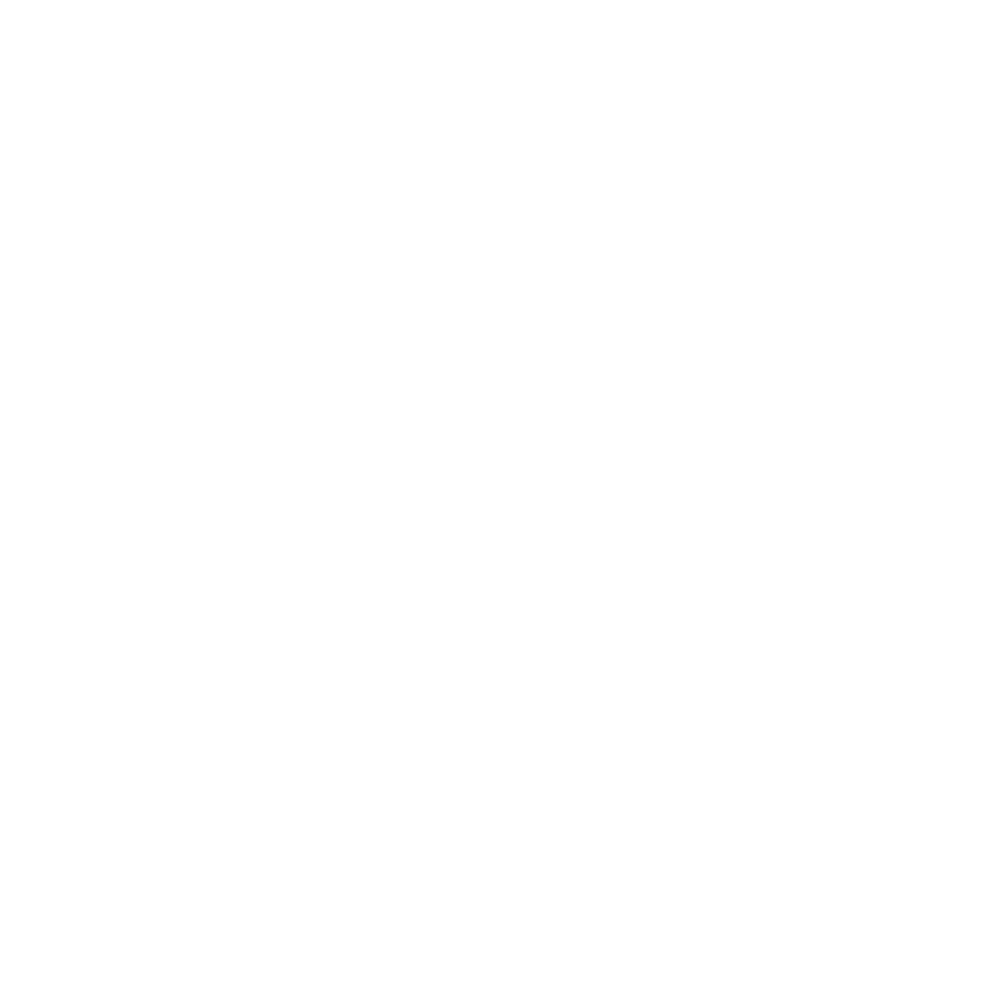

  

E2TMK is a software company focused on building expressive and elegant solutions.  
We believe development should be an enjoyable and creative experience to be truly fulfilling.  
We simplify development by providing modern tools and frameworks for web projects.

## Our Open Source Projects

E2TMK contributes to the open source community with innovative packages that solve real-world problems:

### [Hunter](https://github.com/e2tmk/hunter)  
A powerful hunting and data extraction tool designed to streamline your development workflow.

### [Langfy](https://github.com/e2tmk/langfy)  
An intelligent language processing package that brings AI capabilities to your applications.

And more to come...

## Working with E2TMK

With deep experience in modern web development, E2TMK delivers tailored solutions for businesses of all sizes.  
Our team specializes in:

- **Full-Stack Development** – From concept to deployment  
- **Modern PHP Applications** – Laravel, Livewire, and Filament expertise  
- **Frontend Excellence** – Vue.js and Nuxt.js applications  
- **AI Integration** – Python, LangChain, and intelligent automations  
- **Native Applications** – Cross-platform solutions with NativePHP
